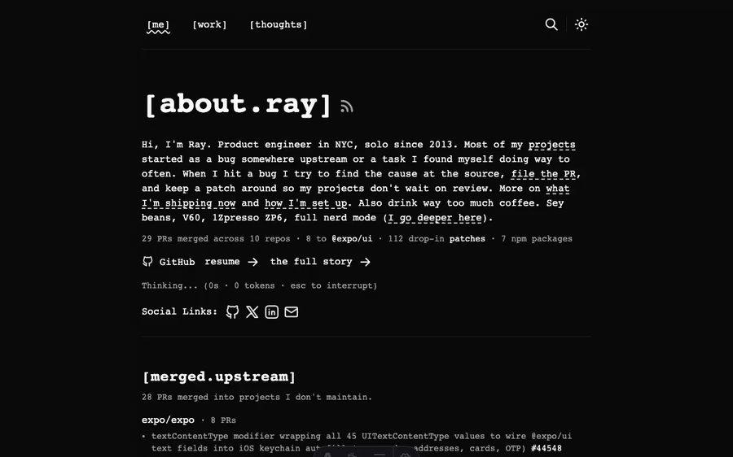

# ramonclaudio.com

[](https://opensource.org/licenses/MIT)

I wanted a site that was fast, lightweight, and static. Astro was the obvious choice, and I wanted it as clean as I could get it. So I forked [astro-paper](https://github.com/satnaing/astro-paper) and went at it.

Bumped Astro 5 → 6 and TypeScript 5 → 6. Swapped Prettier and ESLint out for Oxfmt and Oxlint. Pulled in [`@astrojs/compiler-rs`](https://github.com/withastro/compiler-rs), the new Rust-based Astro compiler, which meant opening a few upstream PRs first ([compiler-rs#22](https://github.com/withastro/compiler-rs/pull/22), [compiler-rs#25](https://github.com/withastro/compiler-rs/pull/25), [napi-rs#3189](https://github.com/napi-rs/napi-rs/pull/3189)) to make the build work end-to-end. Dropped `lodash.kebabcase` and `slugify` for a few lines of native code. Added Vercel Speed Insights and Geist Mono.

Astro 6 + Tailwind CSS v4 + TypeScript 6. Deployed on Vercel. Content collections with tags and pagination. Dynamic Open Graph images per post via Satori + resvg. Pagefind for client-side full-text search. View transitions through Astro's `ClientRouter`. Dark mode follows system preference. Shiki for syntax highlighting (min-light + night-owl).

## Install

```bash
bun install
bun run dev           # dev server on localhost:4321
bun run build         # type-check + build + pagefind index
bun run preview       # preview production build
bun run format        # format with oxfmt
bun run lint          # lint with oxlint
```

Requires Node.js 24+ and Bun.

## Structure

```
src/
  pages/          # file-based routing: blog, projects, tags, search, RSS, OG endpoints
  components/     # Header, Footer, Card, Tag, Pagination, ShareLinks, etc.
  layouts/        # Layout, Main, PostDetails, AboutLayout
  data/           # blog posts (markdown), projects.ts
  styles/         # global.css (Tailwind v4 theme + OKLch tokens), typography.css
  utils/          # post filtering, OG image generation, slug helpers
  config.ts       # site metadata
  constants.ts    # socials, nav
  content.config.ts
```

## License

MIT
